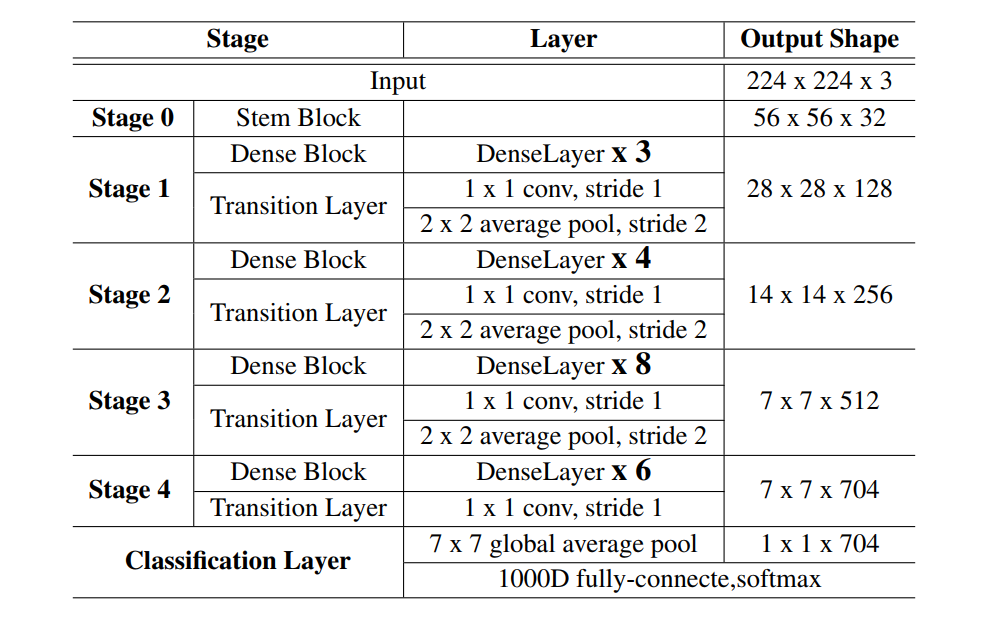
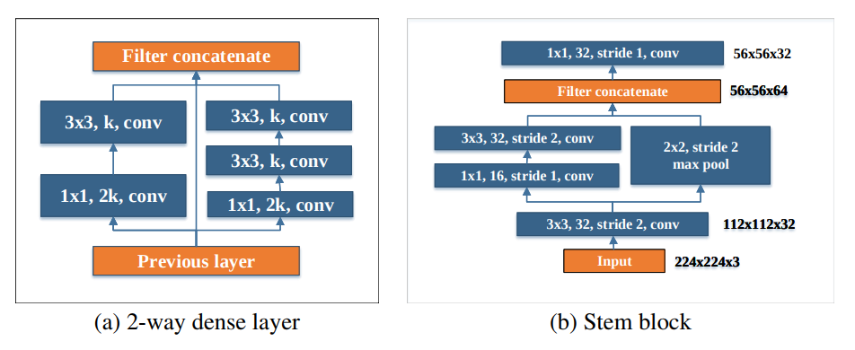
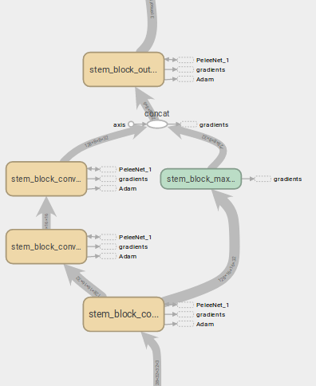
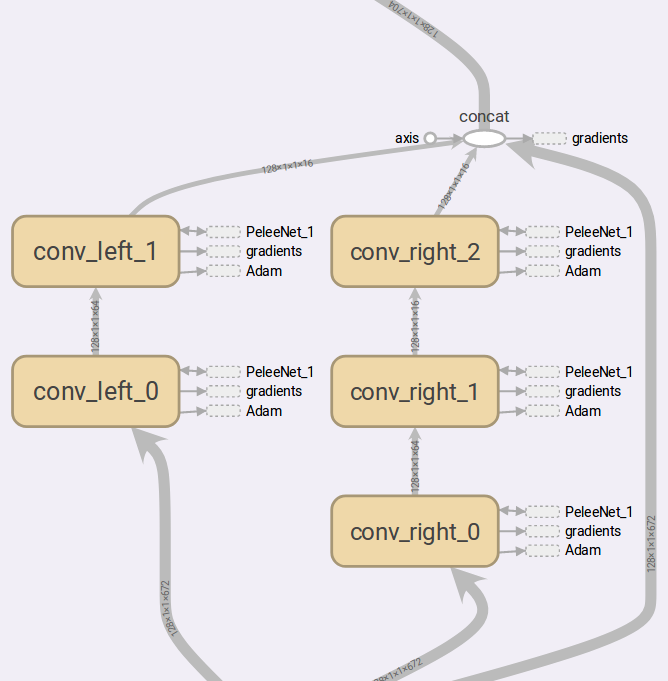
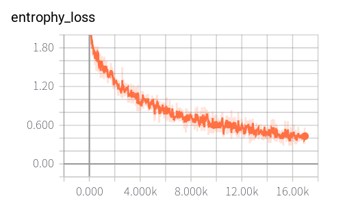

# PeleeNet
  - A tensorflow implement for PeleeNet described in [Pelee: A Real-Time Object Detection System on Mobile Devices](https://arxiv.org/pdf/1804.06882.pdf). This repo mainly focuses on **classification part**.

## Architecture in paper
  - Architecture of peleenet
  
  <p align='center'></p>
  
  - Net block: stem block & dense block
  
  <p align='center'></p>

## Architecture in tensorboard
  - stem block
  <p align='center'></p>
  
  - dense block
  <p align='center'></p>
  
# Configuration
  - GPU: Geforce GTX 1080Ti
  - ubuntu16.04

# Requirements
  - tensorflow >= 1.0
  - python 2.* or python 3.*
  - numpy
  - scipy
  - cPickle
  - Pillow
  
  **Notes**: **Python2 is default**. If you have python3.*, cifar10.py, cache.py dataset.py should be **replaced by files stored in python3 folder**. Any problems, you can email me!!!
  
# Repo Structure
  The following structure show the main frame of this repo.
  
```text
  PeleeNet
  |———— data/                                 # store cifar10 dataset
          |———— cifar10/
  |———— python/                               # python3 support
          |———— cifar10.py              
          |———— cache.py
          |———— dataset.py
  |———— main.py                               # repo entry
  |———— PeleeNet.py                           # mobilenet class
  |———— layers.py                             # stem block, dense_block, transition_layer
  |———— config.py                             # parameters setting
  |———— utils.py                              # generate datasource
  |———— cifar10.py                            # cifar10.py, cache.py dataset.py  for cifar10 reading
  |———— cache.py
  |———— datatset.py
  
  # if you want to use your own datasets, add your datasets type in line 38 in utils.py. 
  # Images are [input_height, input_width, input_channel] formats and labels are one_hot encoding formats.
```

# Usages
## Download Repo
    $ git clone https://github.com/nnuyi/PeleeNet.git
    $ cd PeleeNet

## Datasets
  In this repo, since the computation, I mainly focus on ***CIFAR10*** datasets.
  
  - **CIFAR10:** You are required to download *CIFAR10* datasets [here](https://www.cs.toronto.edu/~kriz/cifar.html), unzip it and store it in ***'./data/cifar10/'*** , note that **CIFAR-10 python version** is required. You can unzip it in ***'./data/cifar10/'*** using the following command:
  
        $ tar -zxvf cifar-10-python.tar.gz
        # you will see that data_batch_* are stored in './data/cifar10/cifar-10-batches-py/'
  
## Training
### [CIFAR10](https://www.cs.toronto.edu/~kriz/cifar.html)

      $ python main.py --batchsize=128 \
                       --is_training=True \
                       --is_testing=False \ 
                       --datasets=cifar10 \
                       --input_height=32 \
                       --input_width=32 \
                       --input_channels=3 \
                       --num_class=10
      
      # If GPU options is avaiable, you can use it as the instruction shows below:
      $ CUDA_VISIBLE_DEVICES=[no] \
        python main.py --batchsize=128 \
                       --is_training=True \
                       --is_testing=False \ 
                       --datasets=cifar10 \
                       --input_height=32 \
                       --input_width=32 \
                       --input_channels=3 \
                       --num_class=10
      
      # notes: [no] is the device number of GPU, you can set it according to you machine
      $ CUDA_VISIBLE_DEVICES=0 \
        python main.py --batchsize=128 \
                       --is_training=True \
                       --is_testing=False \ 
                       --datasets=cifar10 \
                       --input_height=32 \
                       --input_width=32 \
                       --input_channels=3 \
                       --num_class=10

## Results
### Classification
  - After training, you can see that the testing accuracy rate can reach to **89.83%**.
  - loss function and training accuracy shows below:
    
    <p align='center'></p>

# TODO
  - Continute to fine-tuning hyperparameters to improve its accuracy!!!
  - Train in cifar100
  - Train in Caltech101

# References
  - [Pelee: A Real-Time Object Detection System on Mobile Devices](https://arxiv.org/pdf/1804.06882.pdf)
  - cifar10.py is derived from [Hvass-Labs's codes](https://github.com/Hvass-Labs/TensorFlow-Tutorials)

# Contact
  Email: computerscienceyyz@163.com
